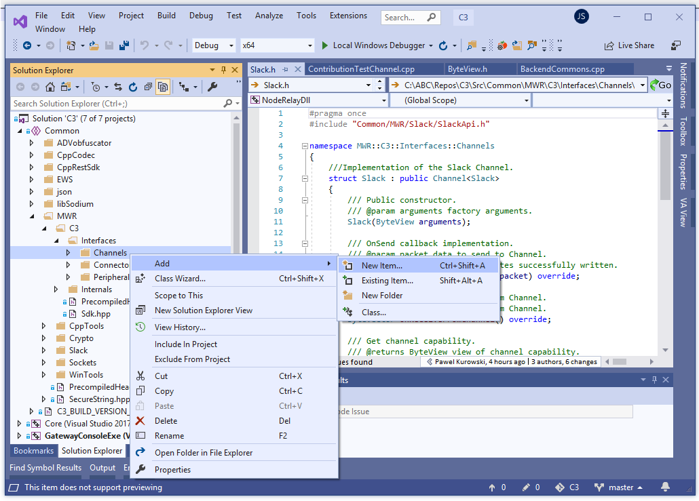
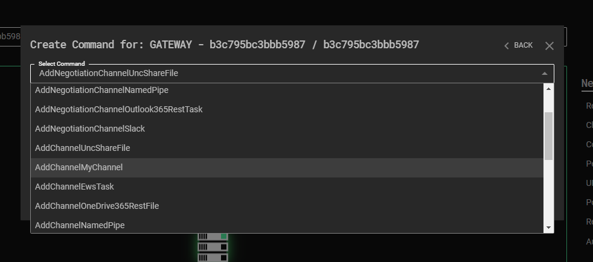
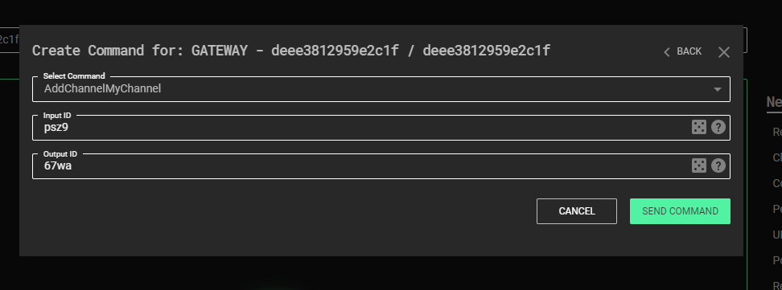
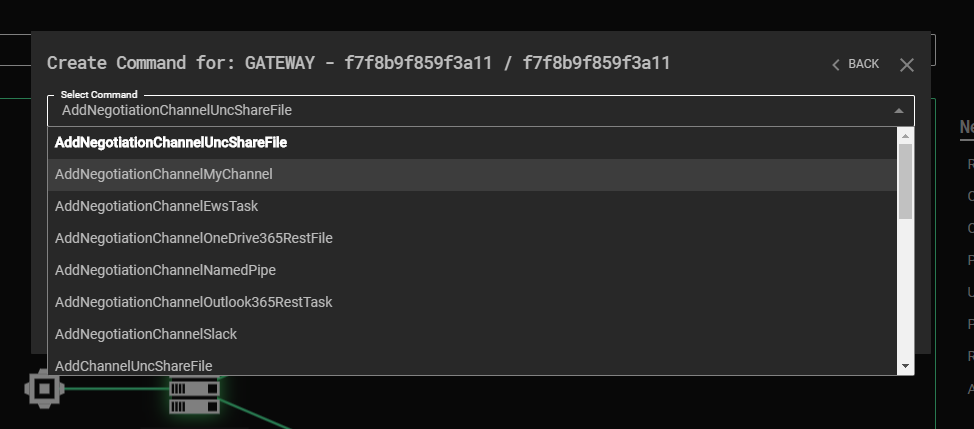
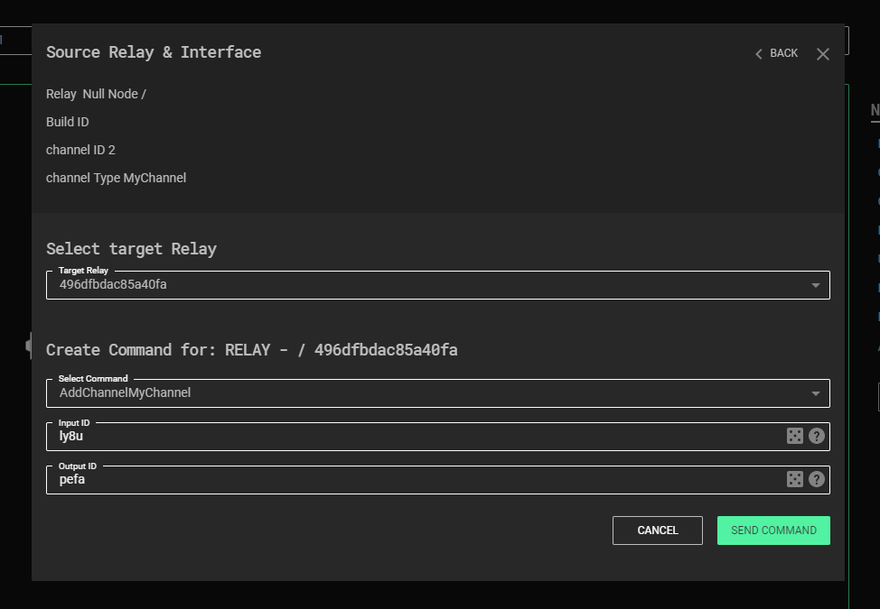
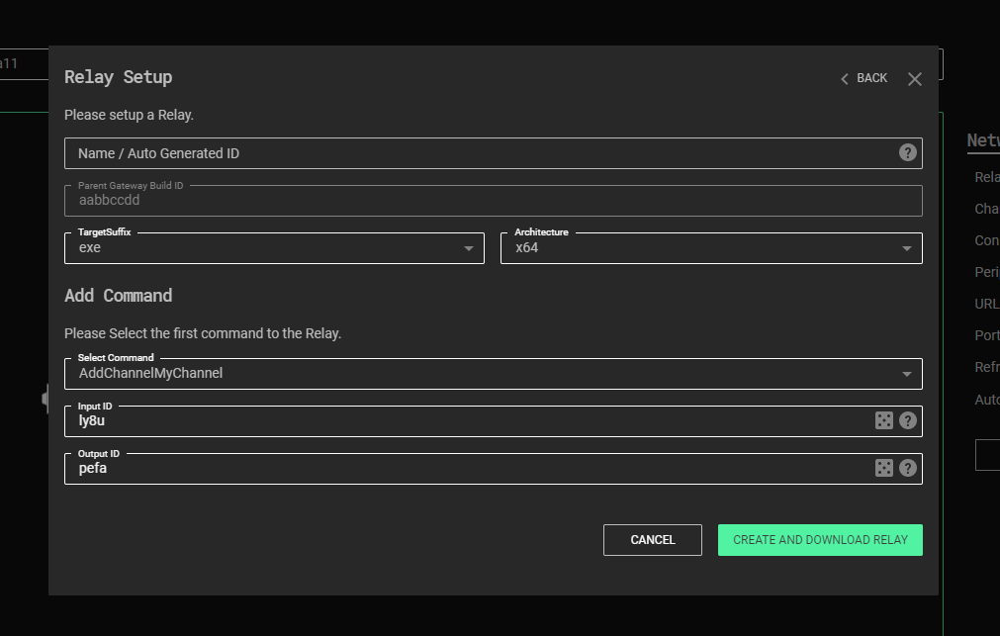

# Developing a Channel

The following tutorials describe the process of C3 channel development in a step by step matter, along with detailed explanations and best practices. This section will demonstrate how to create a channel that utilises Windows named pipes for communication. It will make use of MWR’s helper class in order to achieve communication. The purpose of using this class is to abstract away from how to communicate with named pipes and focus on the C3 framework.

## Basic Tutorial
This tutorial focuses only on a bare minimum effort required to develop a C3 Channel. First, open the C3 solution file in MS Visual Studio and add a new `*.cpp` file to the “Common” project. The Preferred location is: *“Src/Common/MWR/C3/Interfaces/Channels”* or its sub folder.



Next, open the newly created file and enter a type that will represent the Channel. An example for a channel named `MyChannel` is as follows:
```cpp
#include "StdAfx.h"
#include "Common/MWR/WinTools/Pipe.h"

struct MyChannel : MWR::C3::Interfaces::Channel
{
    MyChannel(MWR::ByteView arguments) : m_Pipe("MyChannelPipeName"_bv)
    {
    }

    size_t OnSendToChannel(MWR::ByteView packet) override
    {
        return m_Pipe.Write(packet);
    }

    MWR::ByteVector OnReceiveFromChannel() override
    {
        return m_Pipe.Read();
    }

protected:
    MWR::WinTools::Pipe m_Pipe;
};
```

A breakdown of this code is as such:
+ The first line is required by Visual Studio for projects using precompiled headers.
+ The `MyChannel` struct definition publicly inherits from a *CRTP type* called `Channel<>`, which is required by the C3 framework in order to register the Channel.
+ Next there are three overridden methods – `OnSendToChannel`, `OnReceiveFromChannel` and a constructor that takes one `MWR::ByteView` argument. These methods are used to bind the channel’s functionality with the C3 framework.
+ Note the `m_Pipe` member variable, this is a wrapper for Windows named pipe.
+ For this basic tutorial the argument for the `MyChannel` constructor is ignored. Instead the named pipe member variable is initialised with a hardcoded name. Note that `_bv` is a literal for `MWR::ByteView`.
+ `OnSendToChannel’s` implementation simply takes its parameter (packet) and writes it to the pipe.
+ `OnReceiveFromChannel` reads from the pipe and returns the buffer.

With this file added, the solution can be recompiled. Re-starting the C3 web application is all that is required after compilation to use the newly created channel.



## Advanced Tutorial

This tutorial will cover more advanced features that can allow developers to create complex channels with a rich feature set. This will be demonstrated by extending the previously written named pipe channel. This section will cover:

+ How to define input parameters, allowing users to provide dynamic pipe names from the UI.
+ How to add a custom command.
+ How to use Log functionality and the built-in string obfuscator.
+ How to set a channel’s initial *“Update Delay Jitter”* values.
+ How to perform refactoring, ensuring developers keep to code standards.
+ Discuss requirements of overridden methods and other implementation details.

### Adding a Channel’s Create Arguments

The previously created Channel from the Basic tutorial has a flaw in its implementation – the pipe name is hard-coded. This not only prevents it from being reused multiple times in a single C3 network, but also disables some useful features. For example, this flaw prevents the channel from being used as a *Negotiation Channel*. Additionally, as C3 has no way of knowing the creation parameters of `MyChannel`, it will default them to a single binary blob of data:


The UI can be made to explicitly ask for each parameter and validate their values in a few steps. First, the type of `m_Pipe` is changed from `MWR::WinTools::Pipe` to `MWR::WinTools::DuplexPipe`. The duplex pipe allows for two identifiers to be assigned for every `MyChannel` instance. Whilst not definitively required, this design decision adds a number of benefits.

Before further discussion is given as to the named pipe channel, it is important to understand what a *Double-ID design* is and how it operates. The core concept is to address two communicating interfaces with a unique pair of IDs – as opposed to using one identifier for the pair.

As an example, consider a file system Channel implementation and the various ways communication could be designed:

+ Model 1 - share a file for each pair of C3 Channels.
+ Model 2 - assign a pair of files for each pair of Interfaces. 
+ Model 3 - use a single file (shared by everyone), then assign each party an ID, and precede each packet with two related IDs (e.g. AB if Interface A is talking to Interface B, CA if C is sending a packet to A, etc.).
+ Model 4 - use a single file then assign each party two unique IDs (inbound and outbound) and precede each packet with that ID.

All implementations are valid and will work with the C3 Framework, but some features won’t be available for Model 1. The figure below provides a visualisation of sample incompatible and compatible channel designs.


As can be seen on the bottom diagram (compatible version), “Ch1” Interface’s output ID is the same as “Ch2” Interface’s input ID, and vice versa. The same goes for “Ch2” and “Ch3” pair. This diagram will now be applied to `MyChannel` – every `MyChannel` instance will get an input ID and an output ID assigned to them.

To begin, the definition of the `GetCapability()` `static` method provides a JSON representation of `MyChannel’s` capabilities:

```cpp
static ByteView GetCapability()
{
    return R"({
        "create":
        {
            "arguments":
            [
                [
                    {
                        "type": "string",
                         "name": "Input ID",
                         "min": 4,
                         "randomize": true,
                         "description": "Used to distinguish packets for the channel"
                     },
                     {
                         "type": "string",
                         "name": "Output ID",
                         "min": 4,
                         "randomize": true,
                         "description": "Used to distinguish packets from the channel"
                      }
                  ]
              ]
          }
    })";
}
```

This optional method needs to return a JSON string that contains customisation details of the channel. In this instance, the JSON informs C3 what kind of arguments the channel needs in order to be created (by defining the `"arguments"` array within the `"create"` object).

There are 2 parameters defined, both need to be at least 4 characters long and random values should be assigned to them when the channel creation dialog appears in the UI (this also enables the randomise button next to the argument’s field). Both parameters are of type `string`. Other types supported by C3 include: `int8`, `int16`, `int32`, `int64`, `uint8`, `uint16`, `uint32`, `uint64`, `float`, `boolean`, `binary` and `ip` (IP address). The `name` field is used to label the argument in the UI and the `description` is rendered when a user hovers their mouse cursor over the field’s help icon. There are two other properties that haven’t been specified here: `max` and `defaultValue`. As their names might suggest, they define the maximum length of a `string` argument (or the maximal value of an arithmetic argument) and its default value.

**Note:** Using `"randomize": true` requires the channel to explicitly specify the `min` value.

**Note:** The use of an array for Input and Output ID is important. This tells C3 that the arguments are identifiers and should be swapped for complementary channels (channel’s 1 Input = channel’s 2 Output and vice versa). Developers should avoid the use of an array for other arguments they choose to define for a channel.

The next step in this tutorial involves updating `MyChannel’s` constructor to read the new arguments:

```cpp
MyChannel(ByteView arguments)
  : m_Pipe(arguments.Read<std::string, std::string>())
{
}
```

**Note:** It is up to Channel’s developer to ensure that the type parsed in `Read` is the same type as the one declared in the JSON returned by `GetCapability` (e.g. `"type" : "int16"` should be parsed later as `args.Read<int16_t>()`).

**Note:** The Read method “moves” `ByteView` according to the length of data that was read and allows for multiple parameters to be read at once (e.g. `auto[integer, text, real] = args.Read<int8_t, std::string, float>()`).

**Note:** `std::string` and `MWR::ByteVector` types are stored in a buffer in a way that keeps track of their length (by preceding them with 4 byte-long size).

**Note:** Arithmetic types are always stored in the little-endian byte order.

As in the basic tutorial, compile the whole C3 solution, go to the root folder of C3 and run the *StartWebController.cmd* script. The channel creation command window in the Web UI should now look as such:



Because this channel uses the *Double-ID design*, additional features of C3 will be unlocked. Firstly, a new command will be provided in the user interface that can be used to create a Negotiation channel:



Secondly, C3 will add the “Connect Relay” option to all instances of `MyChannel`, which automatically attaches a complementary `MyChannel` instance (fills in swapped Input and Output identifiers) for a selected Relay:




Finally, C3 will add the “New Relay” option for all existing `MyChannels`, which creates a new Relay payload with a complementary initial Channel:




### Creating a Custom Command

Every *Interface* provides two built-in *Commands*: Close and UpdateDelayJitter. However, channel developers are able to add their own custom *Commands*, by enlisting them in the `static` `GetCapability()` method:

```cpp
static ByteView GetCapability()
{
    return R"({
        "commands":
            [
                {
                    "name" : "Test Command",
                    "description" : "Logs provided text.",
                    "id" : 0,
                    "arguments" :
                        [
                        {
                            "type" : "string",
                            "name" : "Message",
                            "description" : "Message to Log."
                        }
                        ]
                 }
            ]
        })";
}
```

The JSON buffer that `GetCapability` returns defines one *Command* labeled “Test Command”, which takes one `string` argument. The `"id"` field (specified as equal to 0) is needed to distinguish between custom *Commands*, and is required to be in the range **0 – 32767**.

In `MyChannel`, an overriden implementation of `OnRunCommand` is defined:

```cpp
ByteVector OnRunCommand(ByteView command) override
{
    auto commandCopy = command;
        switch (command.Read<uint16_t>())
        {
            case 0:
                return TestCommand(command);
            default:
                return __super::OnRunCommand(commandCopy);
        }
}
```

This method simply parses the first two bytes of the *Command* buffer as the *Command ID*. If its value is different than all *Command IDs* that have been registered then the base class’ `OnRunCommand` method is called – to ensure handling of internal `Commands` remains intact. Therefore, if the *Command ID* is 0, the `TestCommand` method will be called by `MyChannel`.

```cpp
ByteVector TestCommand(ByteView args)
{
    Log({ OBF("Custom Command : ") + args.Read(), LogMessage::Severity::DebugInformation });
    return {};
}
```

The `TestCommand` method adds a debug text entry to C3’s *Log*. `DebugInformation` is used which is rendered in a Relay’s console window only when compiled in debug mode. The message consists of two elements: a hard-coded text "Custom Command : " and a string that is provided by a user in the UI. Note the use of the `OBF` macro, this is used to encrypt strings at compile-time, which are decrypted at run-time only when required. Also of note is that the `TestCommand` handler returns an empty `MWR::ByteVector` as there’s nothing to send back to the Gateway.

**Note:** The `GetCapability` method is compiled only when building Gateway’s executable and therefor it’s not required to use the `OBF` macro to obfuscate its strings. 

After rebuilding the solution once again and launching C3 the Test Command becomes available in `MyChannel’s` Command Center:


**Note:** C3 can be launched in a debug mode by running `dotnet run -c Debug` console command from the *Src/WebController/Backend* location. Debug mode enables Node Relay’s console window, allowing to read their local C3 *Log*.

### Putting it all Together

After developing a functionally working channel, the next stage is to refactor the code. The `MyChannel` type is still quite small, but for larger classes it’s common to split the implementation between a header and a compilation unit file. For `MyChannel` this involves adding a new *MyChannel.h* file in the same location as *MyChannel.cpp*. This also involves embracing the channel with the appropriate namespace declaration - `MWR::C3::Interfaces::Channels`. Finally, doxygen-style documentation is added to improve readability. *MyChannel.h* is then as such:

```cpp
#include "Common/MWR/WinTools/Pipe.h" //< For MWR::WinTools::Pipe.

namespace MWR::C3::Interfaces::Channels
{
    /// Implementation of a Named Pipe Channel.
    struct MyChannel : public Channel
    {
        /// Public constructor.
        /// @param arguments factory arguments.
        MyChannel(ByteView arguments);

        /// OnSend callback implementation. Called every time attached Relay wants to send a packet through this Channel Device. @see Device::OnSend.
        /// @param packet data to send through the Channel.
        /// @return number of bytes successfully sent through the Channel. One call does not have to send all data. In that case chunking will take place, Chunks must be at least 64 bytes or equal to packet.size() to be accepted,
        size_t OnSendToChannel(ByteView packet) override;

        /// Reads a single C3 packet from Channel. Periodically called by attached Relay. Implementation should read the data (or return an empty buffer if there's nothing in the Channel waiting
        /// to read) and leave as soon as possible.
        /// @return ByteVector that contains a single packet retrieved from Channel.
        ByteVector OnReceiveFromChannel() override;

        /// Processes Commands addressed to this Channel.
        /// @param command a buffer containing whole command and it's parameters.
        /// @return command result.
        ByteVector OnRunCommand(ByteView command) override;

        /// Example Command handler. It must be registered/described in GetCapability. @see MyChannel::OnRunCommand.
        /// @param args Command's arguments.
        /// @returns ByteVector Command result.
        ByteVector TestCommand(ByteView args);

       /// Describes Channels creation parameters and custom Commands.
       /// @return Channel's capability description in JSON format.
       static ByteView GetCapability();

       /// Explicit values used as the defaults for Channel's UpdateDelayJitter. Values can be changed later, at runtime.
       constexpr static std::chrono::milliseconds s_MinUpdateDelayJitter = 100ms, s_MaxUpdateDelayJitter = 100ms;

       protected:
       /// The pipe wrapper object.
       MWR::WinTools::DuplexPipe m_Pipe; 
    };
}
```

And the implementation within MyChannel.cpp:

```cpp
#include "StdAfx.h"
#include "MyChannel.h"

/////////////////////////////////////////////////////////////////////////////////////////////////
MWR::C3::Interfaces::Channels::MyChannel::MyChannel(ByteView arguments) 
: m_Pipe(arguments.Read < std::string, std::string > ())
{
  Log({
    OBF("Hello World from MyChannel!"),
    LogMessage::Severity::DebugInformation
  });
}

/////////////////////////////////////////////////////////////////////////////////////////////////
size_t MWR::C3::Interfaces::Channels::MyChannel::OnSendToChannel(ByteView packet) 
{
  return m_Pipe.Write(packet);
}

/////////////////////////////////////////////////////////////////////////////////////////////////
MWR::ByteVector MWR::C3::Interfaces::Channels::MyChannel::OnReceiveFromChannel() 
{
  return m_Pipe.Read();
}

/////////////////////////////////////////////////////////////////////////////////////////////////
MWR::ByteVector MWR::C3::Interfaces::Channels::MyChannel::OnRunCommand(ByteView command) 
{
  /// Check if it's a custom or internal Command, then call appropriate handler. 
  auto commandCopy = command;
  switch (command.Read < uint16_t > ())
  {
  case 0:
    return TestCommand(command); //< Our custom Command. 
  default:
    return __super::OnRunCommand(commandCopy); //< An internal Command. 
  }

}

/////////////////////////////////////////////////////////////////////////////////////////////////
MWR::ByteVector MWR::C3::Interfaces::Channels::MyChannel::TestCommand(ByteView args) 
{

  Log({
    OBF("Custom Command : ") + args.Read < std::string > (),
    LogMessage::Severity::DebugInformation
  });

  return {};
}

/////////////////////////////////////////////////////////////////////////////////////////////////
MWR::ByteView MWR::C3::Interfaces::Channels::MyChannel::GetCapability() 
{
  return R "({ 
  "create":
  {
    "arguments":
      [
        [
          {
            "type": "string",
            "name": "Input ID",
            "min": 4,
            "randomize": true,
            "description": "Used to distinguish packets for the channel"
          },
          {
            "type": "string",
            "name": "Output ID",
            "min": 4,
            "randomize": true,
            "description": "Used to distinguish packets from the channel"
          }
        ]
      ]
  },
  "commands":
  [
    {
      "name": "Test command",
      "description": "Logs provided text",
      "id": 0,
      "arguments":
        [
          {
            "name": "Message",
            "description": "Message to Log."
          }
        ]
    }
  ]
})"; 
}
```

There are two new elements in the header file that have not previously been discussed - `s_MinUpdateDelayJitter` and `s_MaxUpdateDelayJitter`. All C3 Interfaces are updated periodically with some jitter. This is called the *Update Delay Jitter* and is specified by setting two range values in the UI – minimal and maximal. If both values are the same, then *Update Delay Jitter* is constant. If they differ, each delay is randomised in the range specified by min and max. Default (initial) *Update Delay Jitter* is equal to 30ms. If an *interface* needs to specify a different initial value, then it should set it by defining `s_MinUpdateDelayJitter` and `s_MaxUpdateDelayJitter` `public constexpr static` members – as demonstrated above. *Update Delay Jitter* can be changed at run-time with an *Interface’s Commands*.

**Note:** When using third-party APIs for Command and Control (such as Slack), the values set in `s_MinUpdateDelayJitter` and `s_MaxUpdateDelayJitter` directly contribute to avoiding heavy rate limiting.

### Channel Development Summary

The tutorials provided here have discussed all the elements required to develop a channel in C3. `MyChannel` was intended to be as simple as possible in order to focus on C3 specifics. Channels can often be far more complicated and require longer implementations of `OnReceiveFromChannel` and `OnSendToChannel` methods. As such, the following details should be considered:

+ `OnReceiveFromChannel` is fired periodically, while `OnSendToChannel` is fired only if there’s something to send though the Channel. Bear in mind that calls to both methods could be made at the same time from two different threads. Implement appropriate synchronization mechanisms if they share any non-atomic objects.
+ `OnSendToChannel` returns the number of bytes successfully sent to the channel. If it’s less than the size of the provided packet, but more than 63, *automatic chunking* kicks in. If a channel sends less than 64 bytes, C3 will attempt to resend the packet and therefore call `OnSendToChannel` with the same buffer again, while the complementary Channel automatically rejects the packet.
+ `OnReceiveFromChannel` should retrieve only one packet at a time or return an empty buffer (in case there’s nothing to read). An option to return more than one packet is planned to be added in future C3 releases.
+ Both methods should perform the minimal number of operations and leave as soon as possible. There is a possibility to add single-threaded Relays to C3 in the future, which means that only one thread of execution will be shared between all interfaces and all their methods. Bear in mind that one stalling Channel will block the whole Relay, until this method returns. That’s why if a Channel’s overrides (especially updates - `OnReceiveFromChannel`) require more time to execute, the implementation should be split into smaller pieces, *Update Delay Jitter* should be increased, and those pieces invoked in an interlaced manner.
