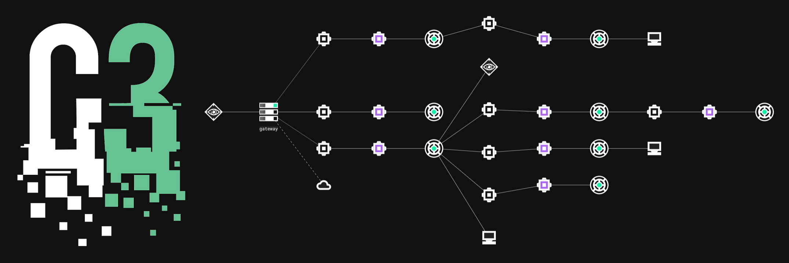

# C3

/badge.svg)

/badge.svg)

C3 (Custom Command and Control) is a tool that allows Red Teams to rapidly develop and utilise esoteric command and control channels (C2). It's a framework that extends other red team tooling, such as the commercial Cobalt Strike (CS) product via [ExternalC2](https://www.cobaltstrike.com/downloads/externalc2spec.pdf), which is supported at release. It allows the Red Team to concern themselves only with the C2 they want to implement; relying on the robustness of C3 and the CS tooling to take care of the rest. This efficiency and reliability enable Red Teams to operate safely in critical client environments (by assuring a professional level of stability and security); whilst allowing for safe experimentation and rapid deployment of customised Tactics, Techniques and Procedures (TTPs). Thus, empowering Red Teams to emulate and simulate an adaptive real-world attacker.

## Usage

See [this](https://labs.withsecure.com/tools/c3) blog post for a detailed tutorial. 

For contribution guide (how to develop a Channel tutorials), see [this page](CONTRIBUTING.md).

## Supported Channels

### External Channels

| Channel Name            | Contributor |
|-------------------------|-------------|
| Mattermost              | [@mariuszbit](https://twitter.com/mariuszbit)        |
| Asana                   | [@tvgdb2](https://twitter.com/tvgdb2)            |
| GitHub                  | [@sunn_y_k](https://twitter.com/sunn_y_k)            |
| Dropbox                 | [@adm1nPanda](https://twitter.com/adm1nPanda)            |
| JIRA                    |             |
| Discord                 |             |
| GoogleDrive             |             |
| Slack                   |             |
| EWS Tasks               |             |
| OneDrive 365 Rest File  |             |
| OneDrive 365 Rest Task  |             |

### Internal Channels

| Service                 | Contributor |
|-------------------------|-------------|
| MSSQL                   | [@checkymander](https://twitter.com/checkymander)            |
| UNC Share File          |             |
| LDAP                    |             |
| Printer Jobs                   |             |

## Detection
- [Hunting for C3 (release blog)](https://labs.f-secure.com/blog/hunting-for-c3/)
- [Attack Detection Fundamentals C2 and Exfiltration Lab - Dropbox](https://labs.f-secure.com/blog/attack-detection-fundamentals-c2-and-exfiltration-lab-3)
- [Attack Detection Fundamentals Discovery and Lateral Movement Lab - UNC Share File](https://labs.f-secure.com/blog/attack-detection-fundamentals-discovery-and-lateral-movement-lab-3/)
- [Using and detecting C2 printer pivoting](https://labs.f-secure.com/blog/print-c2/)
- [Black Hat USA 2021 - I'm a Hacker Get Me Out of Here! Breaking Network Segregation Using Esoteric Command & Control Channels](http://i.blackhat.com/USA21/Wednesday-Handouts/us-21-Coote-Im-A-Hacker-Get-Me-Out-Of-Here-Breaking-Network-Segregation-Using-Esoteric-Command-Control-Channels.pdf)
- [Pursuing Evasive Custom Command & Control - Guide M - ROOTCON](https://media.rootcon.org/ROOTCON%2014%20(Recovery%20Mode)/Talks/Pursuing%20Evasive%20Custom%20Command%20&%20Control%20(C3).pdf)
- [YARA Rule - C3 Reflective DLL Usage](https://gist.github.com/ajpc500/9ae6eb427375438f906b0bf394813bc5)
- [Sigma Rule - C3 DLL Launch](https://github.com/SigmaHQ/sigma/blob/master/rules/windows/process_creation/process_creation_c3_load_by_rundll32.yml)
- [Relay Rumbler - C3 Relay Binary Config Parser](https://github.com/ajpc500/RelayRumbler)

## Glossary

The most commonly used terms in C3:

- `Relays` - stand-alone pieces of C3 Networks. They communicate using `Interfaces`. There are two types of `Relays`: `Gate Relays` (or `Gateways`) and `Node Relays`.
- `Gateway` - a special `Relay` that controls one C3 Network. A C3 Network cannot operate without an operational `Gateway`. The `Gateway` is the bridge back to the attacker’s infrastructure from `Node Relays`. It's also responsible for communicating back to a third-party C2 server (such as Cobalt Strike’s Teamserver). `Gateways` should always be hosted within attacker-controlled infrastructure.
- `Node Relay` - an executable to be launched on a compromised host. `Node Relays` communicate through `Devices` either between one another or back to the `Gateway`.
- `Interface` - a high level name given to anything that facilitates the sending and receiving of data within a C3 network. They are always connected to some `Relay` and their purpose is to extend `Relay's` capability. Currently there are three types of `Interfaces`: `Channels`, `Peripherals` and `Connectors`.
- `Devices` - common name for `Channels` and `Peripherals`. This abstraction is created to generalize `Interfaces` that are able to be used on `Node Relays`.
- `Channel` - an `Interface` used to transport data between two `Relays`. `Channels` works in pairs and do not support the one-to-many transmission (see `Negotiation Channels`).
- `Negotiation Channel` - a special `Channel` capable of establishing regular `Channel` connections with multiple `Relays`. The negotiation process is fully automatic. `Negotiation Channels` support only negotiation protocol and cannot be used in any other transmission.
- `Gateway Return Channel (GRC)` - the configured `Channel` that a `Relay` will use to send data back to the `Gateway`. `GRC` may be a route through another `Relay`. The first `Channel` (initial) on a `Node Relay` is automatically set as `GRC` for that `Node Relay`.
- `C3 Minimal MTU` - the minimal portion of data that every C3 Channel is required to be able to send. Currently `C3 Minimal MTU` is equal to 64 bytes. Unless a chunk shorter than 64 bytes contains a complete packet, receiver Relay ignores it and sender Relay tries and re-sends last portion of data.
- `Peripherals` - a third-party implant of a command and control framework. `Peripherals` talk to their native controllers via a `Controller`. For example, Cobalt Strike’s SMB beacon.
- `Connectors` - an integration with a third-party command and control framework. For instance the ‘External C2’ interface exposed by Cobalt Strike’s Teamserver through the externalc2_start command.
- `Binders` - common name for `Peripherals` and `Connectors`.
- `Device ID` - a dynamic ID that uniquely addresses one `Device` on a `Relay`.
- `Agent ID` - a dynamic ID that uniquely addresses a `Node Relay`. `Node Relays` instantiated from the same executable will have different `Agent IDs`.
- `Build ID` - a static ID that is built into every `Relay`. Stays unchanged over reboots.
- `Route ID` - a pair of an `Agent ID` and a `Device ID`. Used to describe one "path" to a `Node Relay` (`Node Relays` might be reachable via many `Routes`).
- `Route` - a "path" to a `Node Relay`. Every `Relay` keeps a table of all of their child `Relays` (and grandchildren, grand-grandchildren, and so on) along with `Channel` `Device IDs` used to reach that particular `Relay` (see `Route ID`). When a packet from the `Gateway` arrives to a `Node Relay`, routing table is used to choose appropriate `Channel` to send the packet through to the recipient.
- `Update Delay Jitter` - delay between successive updates of an `Interface` (in case of `Channels` - calls to OnReceiveFromChannel method). Can be set to be randomized in provided range of time values.

## License

BSD 3-Clause License

Copyright (c) 2019-2020, F-Secure
Copyright (c) 2018-2019, MWR Infosecurity
All rights reserved.

Redistribution and use in source and binary forms, with or without
modification, are permitted provided that the following conditions are met:

1. Redistributions of source code must retain the above copyright notice, this
   list of conditions and the following disclaimer.

2. Redistributions in binary form must reproduce the above copyright notice,
   this list of conditions and the following disclaimer in the documentation
   and/or other materials provided with the distribution.

3. Neither the name of the copyright holder nor the names of its
   contributors may be used to endorse or promote products derived from
   this software without specific prior written permission.

THIS SOFTWARE IS PROVIDED BY THE COPYRIGHT HOLDERS AND CONTRIBUTORS "AS IS"
AND ANY EXPRESS OR IMPLIED WARRANTIES, INCLUDING, BUT NOT LIMITED TO, THE
IMPLIED WARRANTIES OF MERCHANTABILITY AND FITNESS FOR A PARTICULAR PURPOSE ARE
DISCLAIMED. IN NO EVENT SHALL THE COPYRIGHT HOLDER OR CONTRIBUTORS BE LIABLE
FOR ANY DIRECT, INDIRECT, INCIDENTAL, SPECIAL, EXEMPLARY, OR CONSEQUENTIAL
DAMAGES (INCLUDING, BUT NOT LIMITED TO, PROCUREMENT OF SUBSTITUTE GOODS OR
SERVICES; LOSS OF USE, DATA, OR PROFITS; OR BUSINESS INTERRUPTION) HOWEVER
CAUSED AND ON ANY THEORY OF LIABILITY, WHETHER IN CONTRACT, STRICT LIABILITY,
OR TORT (INCLUDING NEGLIGENCE OR OTHERWISE) ARISING IN ANY WAY OUT OF THE USE
OF THIS SOFTWARE, EVEN IF ADVISED OF THE POSSIBILITY OF SUCH DAMAGE.
