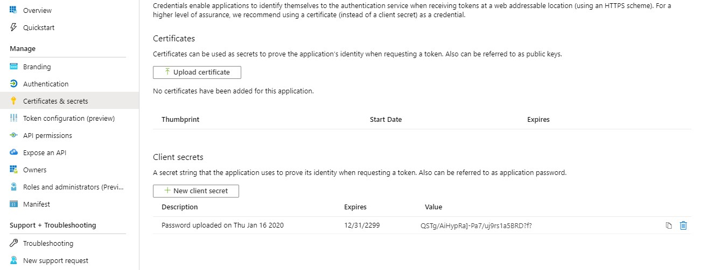
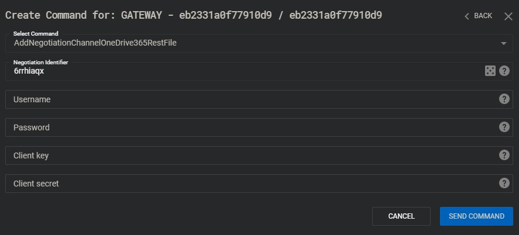

# Office365 Channels Readme

## Setup

Prior to using Office 365 Management APIs within C3, the steps below must be taken.
1. Register an app in Microsoft Azure.
2. Generate secret key for the app.
3. Give the app the correct api permissions.
4. Add the app to allowed applications for desired user with Office365.
5. Pass authentication data to C3 channel.

#### Register app in Microsoft Azure
Outlook365RestTask and OneDrive365RestFile uses Office 365 Management API to send and receive data.
Each application requesting access to this API must be registered with specific API permissions.

Browse to:
```
https://portal.azure.com/#blade/Microsoft_AAD_IAM/ActiveDirectoryMenuBlade/RegisteredAppsPreview
```
Click "New registration". You should be presented with the following screen:


Add name for your application.
As supported account types choose "Accounts in any organizational directory and personal Microsoft accounts".

#### Generate secret key for the app
Under 'Certificates & secrets' generate new secret. Copy the secret as it will be hidden later.



#### Give the app the correct api permissions

Directly after creation of the app, give it the correct permissions. To do this, click on the "API permissions" option.

You should be presented with the following screen:


The following permissions are required:
* https://outlook.office365.com/Tasks.ReadWrite	(Exchange/Delegated)
* https://graph.microsoft.com/Files.ReadWrite	(Graph/Delegated)

#### Add the app to allowed applications for desired user with Office365
**Create separate account. Never use admin account transporting environment for C3!**

If user creating application is also an admin of target user tenant, it is possible to directly grant permission from "API permissions".


Otherwise, target user must sign in to agree with usage of application popup.


For onedrive channel use:
```
https://login.windows.net/common/oauth2/v2.0/authorize?client_id=<application_id>&scope=https://graph.microsoft.com/.default&response_type=code
```

For outlook channel use
```
https://login.windows.net/common/oauth2/v2.0/authorize?client_id=<application_id>&scope=https://outlook.office365.com/.default&response_type=code
```

#### Pass authentication data to C3 channel
With application data, and tartget username/password C3 can use Office 365 Management API.



## Rate Limit

Office Management API introduces rete limit for application. Each channel instance will send GET request every 3 to 6 seconds, to receive packets from server. Multiple channels accessing one office application can consume whole limit causing other connections to throttle.


Both Outlook365RestTask and OneDrive365RestFile are using delay stored in 429 error response header, to wait time period recommended by the server. Refreshed limit will allow some of channels to perform correct transmission, but large amount of instances will consume new limit leaving other instances virtually unusable.


Avoid creating negotiation channels with the same credentials as already working connections that are expensive to lose.
