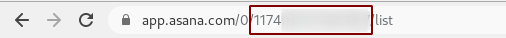
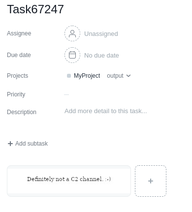

## The Asana channel

### Usage

The Asana channel uses [asana.com](https://asana.com/) (a popular cloud-based project management and task tracking tool) to communicate messages back and forth between the C3 gateway and the Relay. To use this channel, you'll need to provide C3 with two parameters:

* An Asana Personal Access Token
* The Asana Project's `gid`

Asana is [free to use](https://asana.com/pricing) (with a limited number of features, but we only need the basic stuff). 
To register a new Asana account, go to [asana.com/create-account](https://asana.com/create-account) and sign up using your email address. After the initial setup, you should have registered a workspace and a project. 

To retrieve the `gid` of the project, simply browse to "My Workspace" in the sidebar and open the project. The `gid` should appear in the URL bar.

That number (starting with '1174' in the screenshot) is the `gid`. You'll need this when creating the channel in the web interface.

The second thing you'll need is a Personal Access Token. This token is Asana's version of an API key; it identifies you to the API. To generate a Personal Access Token, browse to [app.asana.com/0/developer-console](https://app.asana.com/0/developer-console) and select "New access token".

With these two parameters, you can create the Asana channel in the C3 web interface. 

### How the channel works

How a C3 channel works is well-explained in [CONTRIBUTING.md](../CONTRIBUTING.md); this section will (briefly) explain how the Asana channel uses Asana's features to achieve C2 communication. 

**Initialization**

The channel starts by initializing two [sections](https://asana.com/guide/help/projects/sections) in the provided project (one for inbound communication, one for outbound). 

**Sending messages**

Messages are sent as Asana tasks. For every message, a new task is created in the outbound section. 

Sending messages works as follows: first, the size of the message is checked. The size of the message will dictate how we'll send this message to the other end of the channel. If the message is sufficiently small, we can transfer the message in one API call by base64 encoding the message and saving the result in the `Description` field of a task. 

If the message is too large to fit in the `Description` field, we upload an attachment to the task instead. Since creating a task and uploading an attachment can't be done in one API call, we need to ensure that the receiving end does not process the task before we have added the attachment. This is done by appending `:writing` to the task name (tasks with this suffix will be ignored by the receiver). 

After we successfully upload the attachment, we rename the task to remove the `:writing` suffix.

The messages in an attachment are obfuscated by prepending them with a JPEG image. We do this to avoid detection: a file containing a random string of bytes or a base64 text file might arouse suspicion, while a valid JPG image might not. Of course this is a very basic way of hiding the message, but its all I managed to do with my limited C++ skills.

I would highly recommend to avoid using the default image in engagements. You can edit the prefix in `Asana.cpp` (variable `std::string attachmentPrefixBase64`). 

**Receiving messages**

Receiving messages is more straightforward: all tasks in the inbound section are listed and retrieved. The message is retrieved by checking if the task contains an attachment; no attachments indicate the message is in the `Description` field, otherwise the message is contained in the attachment. Then all tasks are sorted by creation date (to ensure proper order of delivery) and, if applicable, the JPEG prefix is removed. 