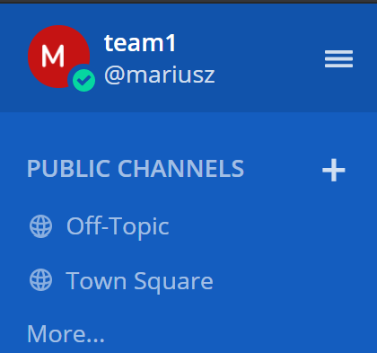
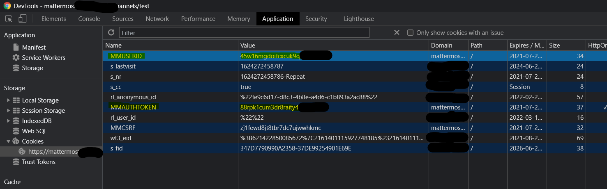

# Mattermost Channel

Mattermost is an open-source alternative for Slack or Discord communication platforms. 
Offers a team collaborations through dedicated "Team" workspaces (analogy to Slack's Workspaces or Discord servers), where each team can contain a number of both public and private channels. 

Such an architecture makes it a perfect candidate for store-and-fetch type of communication channel for frameworks such as C3. The C3 channel implementation is based on Tim's Slack one, leveraging similar post and replies data storage principles.


## Setup

Mattermost instances may be located inside of target networks deployed manually for internal development teams purposes, or an instance could be installed by Red Team operator on a dedicated infrastructure.

Installation guide can be found here:
https://docs.mattermost.com/install/prod-docker.html

The freeware edition is sufficient to utilise it as a channel and SMTP setup is not required.

Prior to using Mattermost API within C3, the steps below must be followed.
1. Install or locate Mattermost server to use.
2. Create an account and either join to a Team or create a new one. Save that Team's name somewhere, as its going to be needed later on.



3. Generate Personal Access Token clicking on your _user name -> Account Settings -> Security -> Personal Access Tokens_


3. Insert the generated Personal Access Token to C3 channel.

### Notice

If there is no _Personal Access Tokens_ part of an interface available, this will mean that functionality was not enabled in Mattermost's system console (which in turn is available only for Mattermost admins). 

Assuming you have administrative rights over your Mattermost server, you can enable that functionality by going to:
_System Console -> Integrations -> Integration Management -> Enable Personal Access Tokens_

(URL: `/admin_console/integrations/integration_management`)


## Channel creation

Now, to actually create your channel you will need following parameters to get straight:

1. **Server URL** - the full URL of the server, that starts with a scheme (http/https), contains port number one's needed. Example: `https://my-mattermost.com:8080`

2. **Team Name** - The team name (or ID) that will have channels created to facilitate communication. First screenshot in this page indicates that team is named `team1`

3. **Access Token** - The Personal Access Token value, should be something like that: `chhtxfgmzhfct5qi5si7tiexuc` (also acquired from authenticated session cookie named `MMAUTHTOKEN`)

4. **Username** - Username (or `user_id`, also acquired from authenticated session cookie named `MMUSERID`) of the user associated with that access token.


### Remarks

Some Mattermost deployments use Single-Sign On functionality to authenticate to Mattermost using providers such as GitLab. Sometimes even Mattermost can have Personal Access Tokens functionality disabled preventing you to generate your own tokens. These cases are not directly supported by this C3 channel, however there is an easy workaround for them. As soon as you successfully authenticate to the Mattermost server, review your HTTP session cookies.

You'll find your temporary _Personal Access Token_ stored in a cookie named `MMAUTHTOKEN`, whereas your user's ID will be stored in `MMUSERID` cookie (however Username should be sufficient to setup this channel correctly).



The username is required to setup the channel properly, as sometimes there are Mattermost teams that are visible only to the specific user (the not global ones). If user created his own Team, he might be unable to find it using typical Mattermost APIs, and a different API would need to be called requiring user's ID. That case is handled by this version of the C3 Mattermost channel, provided the username is non-empty.


## Rate Limit

There is a rate limiting implemented for Mattermost API. Consecutive requests will quickly be bounced off by nginx with HTTP 429 status code. Should that occur, Mattermost C3 channel will cool down before resending affected request with a random delay between 10 to 20 seconds. More information can be found here: [Mattermost API Rate Limiting](https://api.mattermost.com/#tag/rate-limiting)

You can change the Rate Limitting threshold or even disable that functionality if you have access to the Mattermost configuration files on the server it's been launched. 

To do so, edit the `config.json` file located at:

```
mattermost-docker/volumes/app/mattermost/config/config.json
```

Find `RateLimitSettings` section and flip the `Enable` from `true` to `false` option:

```
"RateLimitSettings": {
		"Enable": false,
		"PerSec": 10,
		"MaxBurst": 100,
		"MemoryStoreSize": 10000,
		"VaryByRemoteAddr": true,
		"VaryByUser": false,
		"VaryByHeader": ""
	},
```

After that you'll have to restart your Mattermost server. If it's been ran using `docker-compose` then like so:

```
mattermost-docker/ $ sudo docker-compose restart
```

After that you'll be free to issue `Set UpdateDelayJitter` command on your C3 Channel with values of your choosal.


## Performance

To optimize channel's performance one could consider removing old or dangling messages from Mattermost channels.

To do so, two approaches are discussed:

### 1. By using C3 Channel command

There is a C3 Mattermost Channel command named _"Clear all channel messages"_ that purges all messages from the Mattermost channel configured.
Due to this, messages lookup will get a bit faster optimizing entire channels throughput. 

Also, if for whatever reason there are dangling, not-processed messages in your Mattermost channel, they will be subject for examination during C3 I/O operations.
Whenever that's something not desired, they could be removed using discussed command.


### 2. By directly interacting with Mattermost's Postgresql Database

Another more radical approach to lift general Mattermost server cleanup, would be to remove all posts and uploaded files information.
To do just that, one has to interact with Mattermost's Postgresql database in order to purge `posts` and `fileinfo` tables.

The following script will facilitate that assuming correct database credentials are given:

```
#!/bin/bash

HOSTNAME=localhost
USERNAME=mmuser
PORT=5432
DATABASE=mattermost
DOCKERNAME=mattermost-docker_db_1

docker exec -it $DOCKERNAME psql -h $HOSTNAME -d $DATABASE -U $USERNAME -p $PORT -c 'delete from posts'
docker exec -it $DOCKERNAME psql -h $HOSTNAME -d $DATABASE -U $USERNAME -p $PORT -c 'delete from fileinfo'
```

Be careful though - this script will corrupt your ongoing Mattermost I/O operations!

Use only when you're sure you can afford losing all unprocessed posts.