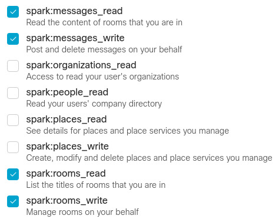
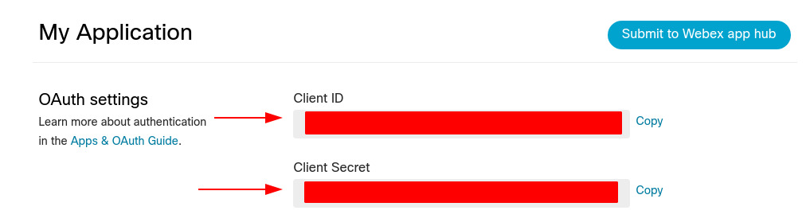
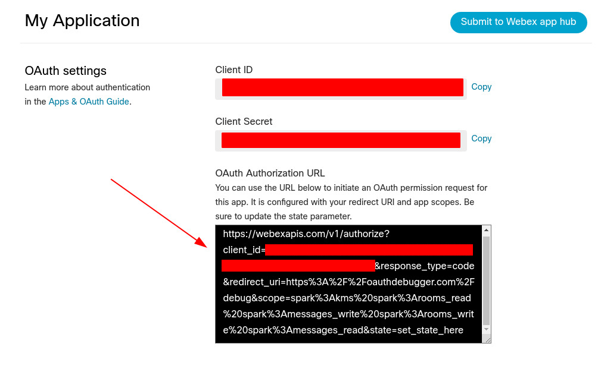
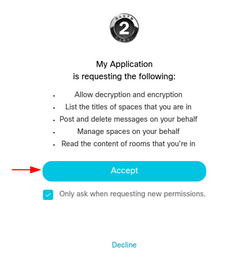
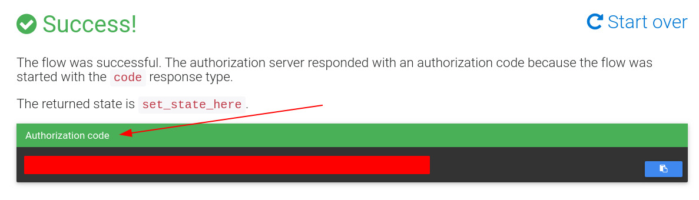
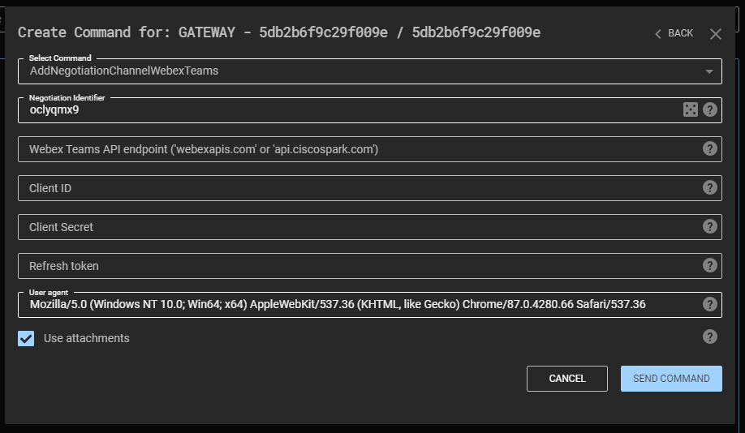
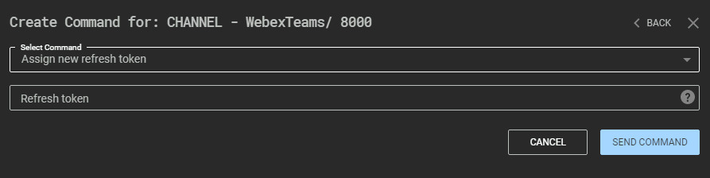
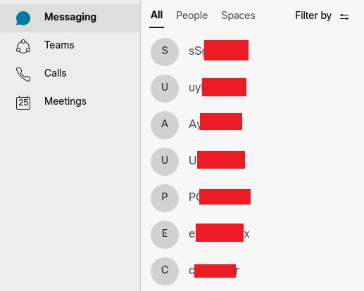

## The Webex Teams channel

This channel uses [Cisco Webex Teams](https://www.webex.com/team-collaboration.html) to communicate messages back and forth between the C3 Gateway and the Relay.
Webex Teams is [free to use](https://www.webex.com/pricing/index.html) with a limited set of features. This channel only makes use of features that are included in the free version.

This guide will lay out the different steps required to get C3 working with Webex Teams, how the channel works internally, and finally, a section on operational security concerns. 

## Using the channel

### Setting up Webex Teams

The steps below will guide you through setting up your Webex Teams environment with a custom application, which we'll need to use Webex with C3. 

#### Step 1: Sign up for Webex Teams

To use this channel, you'll need a non-public email address; Webex Teams only allows 'work email addresses'. Well-known, free email domains, such as gmail.com or outlook.com, won't work.

Sign up for an account at [web.webex.com](https://web.webex.com/). Although untested, lesser-known public email providers could work as well.

As a general OPSEC concern, you shouldn't use any identifiable information in a real engagement. The email address isn't directly embedded in a Relay, nor is is directly visible over the wire, but someone that intercepts the `refresh_token` could retrieve information about the email address by contacting the Webex API.

#### Step 2: Create an Integration.

Webex [supports several authentication mechanisms](https://developer.webex.com/docs/api/getting-started) to authenticate to the API. This channel is implemented to use an Integration (OAuth application).

Navigate to [developer.webex.com/my-apps/new/integration](https://developer.webex.com/my-apps/new/integration) and log in with your Webex Teams account. 
Enter an _Integration Name_, _Contact email_, _Icon_ and _description_ (these can be anything). 
At _Redirect URI(s)_ enter `https://oauthdebugger.com/debug`. 
Under _Permissions_, select `spark:messages_read`, `spark:messages_write`, `spark:rooms_read` and `spark:messages_write`.



Once the integration is created, you'll notice the _OAuth Settings_ section. Make note of the `Client ID` and `Client Secret` (you'll need these later).



#### Step 3: Authorize the Integration

Next, we need to authorize the application and obtain an authorization code. 

On the page with the Integration details, you'll see the _OAuth Authorization URL_. Browse to this URL and log in with your Webex account, if requested.



On the authorization screen, click "Accept". This authorizes the OAuth application to interact with Webex Teams on your behalf. 



You'll be redirected to oauthdebugger.com (the `Redirect URL` we set earlier). Make note of the `Authorization Code` (you'll need this later).



#### Step 4: Obtain a `refresh token`

Finally, we need to convert the `Authorization code` into a `refresh token`. 
To do so, run the following cURL command (make sure to fill in the `client_id`, `client_secret` and `code` parameters).

```bash
curl.exe --request POST --location 'https://webexapis.com/v1/access_token' --header 'Content-Type: application/x-www-form-urlencoded' --data-urlencode 'grant_type=authorization_code' --data-urlencode 'redirect_uri=https://oauthdebugger.com/debug' --data-urlencode 'client_id=<your client id>' --data-urlencode 'client_secret=<your client secret>' --data-urlencode 'code=<your authorization code>'
```

The HTTP response will be a JSON.

```json
{
    "access_token":"<access token>",
    "expires_in":1209599,
    "refresh_token":"<refresh token>",
    "refresh_token_expires_in":7775999
}
```

Make a note of the `refresh_token`, we'll need this when configuring the C3 channel. 

Additionally, you might want to determine when your refresh token expires. The `refresh_token_expires_in` value expresses the delay until the refresh token expires (in seconds). After this deadline, the refresh token won't work anymore and you'll need to go through this process again to get a new refresh token (you can use the same Integration though). 

**Note:** Relays and Gateways will stop communicating if the refresh token expires! You can deploy a new `refresh_token` to an existing Relay/Gateway using the custom command "Assign a new refresh token" (see below).

### Creating the C3 channel

This section will cover how to create the C3 channel in the C3 web interface.

In the C3 web interface, select the desired node (usually the Gateway) and select `AddNegotiationChannelWebexTeams` or `AddChannelWebexTeams`. 



The interface presents several options:

* `Negotiation Identifier` - this is the channel ID that C3 uses. Under the hood, this channel implementation will create a Webex room using this identifier (see "How the channel works" below).
* `Webex Teams API endpoint` - this option determines which API endpoint C3 uses. Only two options are possible: `webexapis.com` and `api.ciscospark.com`. See the OPSEC considerations below for more information.
* `Client ID` - this is the Client ID of the Webex Integration you've created above.
* `Client Secret` - this is the Client Secret of the Webex Integration you've created above.
* `Refresh token` - this is the `refresh_token` value you've requested above.
* `Use attachments` - this controls whether C3 will use attachments to increase communication speed over the channel. See the OPSEC considerations below for more information.

Once the channel is created, you can create a new Relay with the same options.

If you're nearing the expiration deadline of your `refresh_token`, you can instruct an existing C3 channel to use a new `refresh_token`. To do so, select the channel in the C3 web interface and issue the command "Assign new refresh token".



**Note:** Relays and Gateways communicate using two different C3 channels (purple and green in the web interface). You'll need to assign a new refresh token to both channels to ensure Gateway and Relay can communicate in both directions.

**Note:** Once the refresh token expires, new Relays won't be able to check in with the Gateway. To avoid this, you'll need to recreate your (negotiation) channel(s) and regenerate your Relay executables. Existing Relays can be assigned a new refresh token (see above).

## How the channel works

This channel implementation uses the Cisco Webex Teams API to exchange data between Relays and Gateways. To do so, it uses two features of Webex: messages & rooms. In Webex, messages are grouped into a 'room' (like channels on Slack). 

When a new C3 channel is initialized, it will retrieve the Webex room (or create a new one) based on the channel ID. The channel ID is used as the 'title' for the room. You can see this happening in the [Webex web UI](https://web.webex.com).



Once the room is created, C3 will start sending messages across. 

When sending data over the channel, C3 will behave differently based on the configured settings and the data size:

- If attachments are enabled (see channel option above) and the data size would require over 30 normal messages, C3 will opt to use attachments. Attachments are uploaded through regular `multipart` HTTP requests, which may be subject to inspection in the target's environment (see OPSEC considerations below).
- If attachments aren't enabled or the data can be transferred in 30 messages or less, C3 will split up the data into chunks (max 7439 bytes per message), base64 encode them and send all messages sequentially. This can result in large bursts of API calls (see OPSEC considerations below). 

When a message is read and processed successfully, C3 will delete the message from the room. 

**Note:** Webex rooms are not deleted when the C3 channel is destroyed. 

**Note:** C3 will honor the rate limiting enforced by the Webex API, but will not rate limit itself to reduce network activity (except for C3's built-in Delay/Jitter options when checking for new messages).

## Operational Security (OPSEC) concerns

There are several OPSEC considerations when using this channel in your engagement. The three most important ones are:

1. Use a proper `User-Agent ` value in the channel options. 

   Using a proper `User-Agent` helps with 'blending in' with other network traffic in the target's environment. 

2. Choosing an API endpoint (`webexapis.com` or `api.ciscospark.com`). 

   Cisco has [deprecated](https://developer.webex.com/blog/introducing-the-new-webexapis-com) the use of `api.ciscospark.com` in favor of `webexapis.com` (May 2020). Although the new `webexapis.com` endpoint works identically to the old `api.ciscospark.com` endpoint, [official Cisco documentation](https://help.webex.com/en-us/WBX264/How-Do-I-Allow-Webex-Meetings-Traffic-on-My-Network#id_135010) does not mention the new API endpoint yet, hence it might not be allowed yet in the target's environment. 
   This option is also included for future compatibility (if and when Cisco removes the `api.ciscospark.com` endpoint).

3. Choosing whether or not to enable attachments. 

   Using attachments has significant improvements to the speed at which the Relay and Gateway can exchange messages: a single Webex message is [limited to 7439 bytes](https://developer.webex.com/docs/api/v1/messages/create-a-message), while attachments can [grow up to 100MB](https://developer.webex.com/docs/api/basics#message-attachments). Keep in mind that normal messages are base64 encoded, which provides an additional ~33% data overhead. For example, if the channel data is 1MB, C3 will need around ~180 API calls to retrieve the data using normal messages, while it would only need 2 API calls if you're using attachments. C3 will also need approximately the same number of API calls to delete the messages from Webex once they're read (i.e. you'll need ~360 API calls to transfer 1MB when using only normal messages, while you'll only need 3 API calls when using attachments).

   The upsides of attachments are clear, but there's also downsides:

   1. Attachments are transferred as files over the wire, therefore they're possibly subject to more stringent inspection by network defenses compared to traditional API calls (e.g. A/V solutions or DLP policies). 

      To counter network inspection, the channel has (very basic) obfuscation built-in: attachments are prepended with a set of hardcoded bytes and are uploaded with an inconspicuous filename (see [Src/Common/FSecure/C3/Interfaces/Channels/WebexTeams.cpp](../Src/Common/FSecure/C3/Interfaces/Channels/WebexTeams.cpp)). By default, the GZIP magic bytes are prepended and the filename is set to `backup.tar.gz`. You can change these to any value you like, as long as the Webex API will accept them as attachments.

   2. The Webex API endpoint doesn't provide the contents of attachments directly. Instead, the API will provide a URL where the client can retrieve the attachment. This URL is entirely controlled by the API and C3 will blindly trust this URL. This could cause the Relay/Gateway to connect to unintended domains/endpoints. For example, if tomorrow  Cisco decides that attachments are hosted in `randomciscowebsite.com`, C3 will suddenly be making HTTP calls to `randomciscowebsite.com`, which might not be desirable in your engagement.
   
      During testing, we observed that (at this time) attachments are hosted at `webexapis.com`, however, Cisco could change this at any time. 